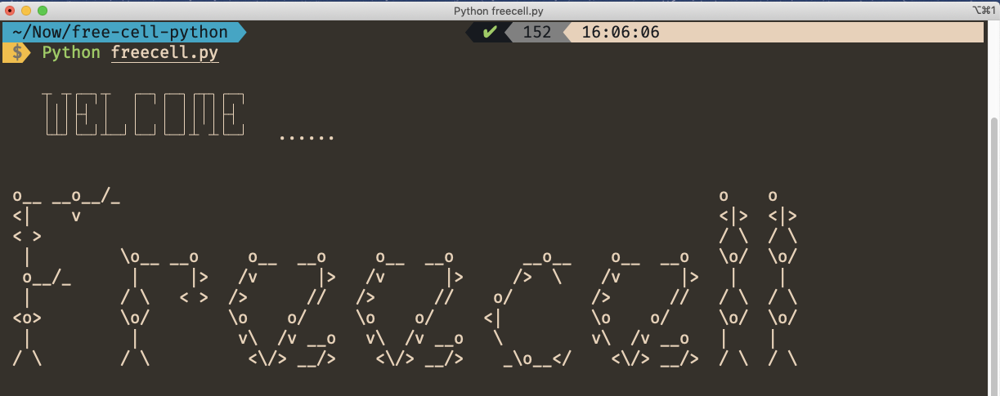
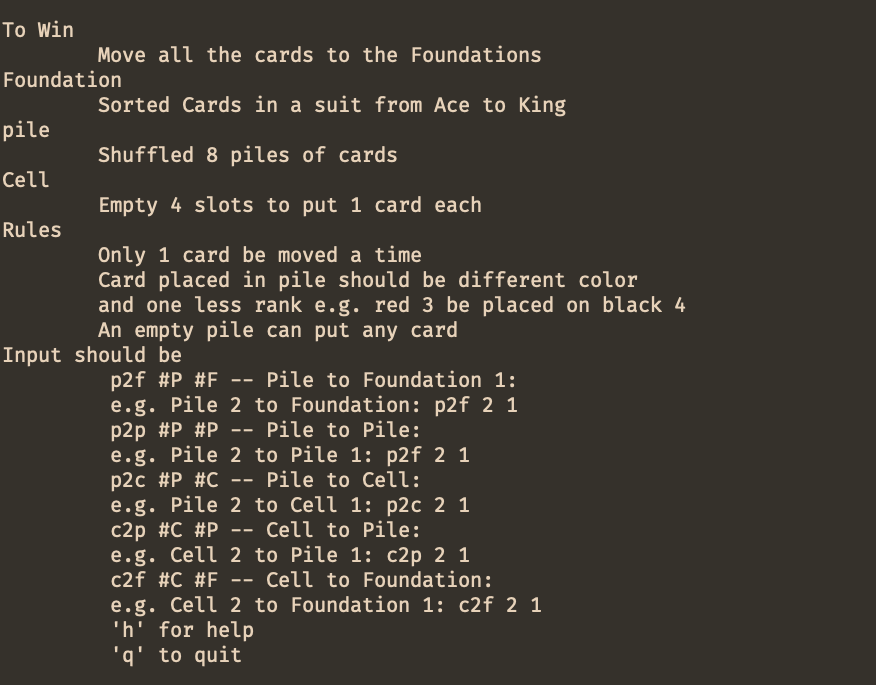
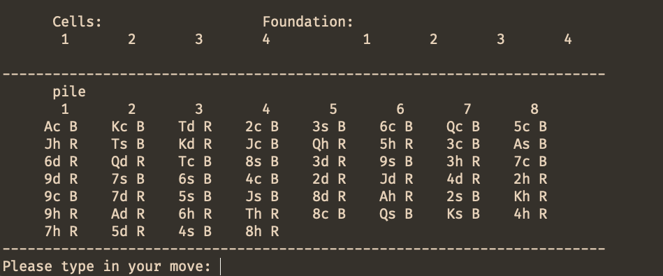
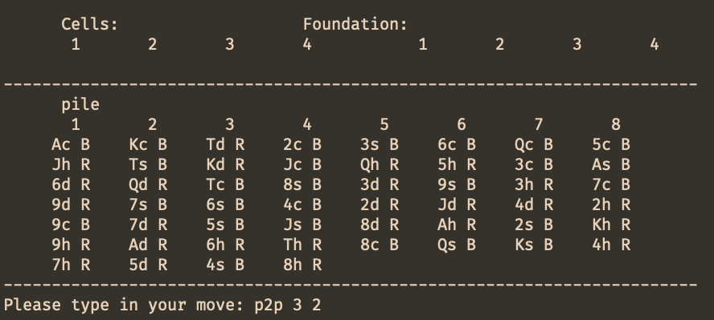
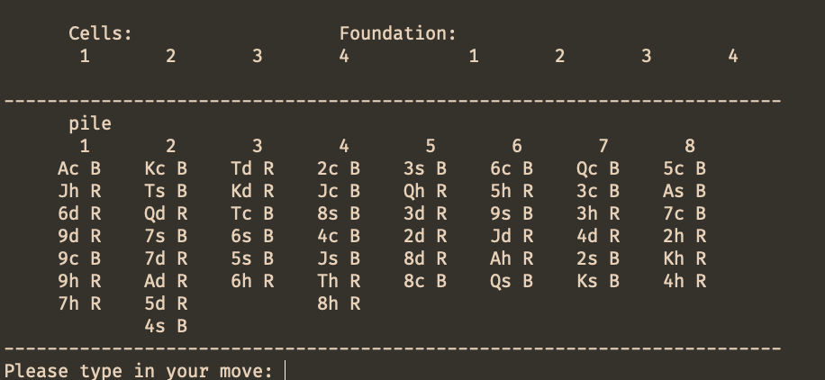

# **Freecell Game in Text Form Writing in Python**

##I. Motivation

Freecell was my mom's favorite game in Window 98 when she bought the first desktop PC for our family. Therefore, after I learned Object-Oriented (OO) programming in python in 2017, the first project completed is writing a Freecell game with python in memory of my parents' early vision in computational literacy and their support on my adventure in computational social sciences research. Though this is the least serviceable project, I have done, compared with some widgets I wrote, helped my mom making Excel spreadsheets 🤣

### Notes on Object-Oriented (OO) programming

In the Freecell game context, "poke cards" and "a deck of cards" are the two objects that can be reused in various card games, for instance, BlackJack, Spider, Texas hold'em. Therefore, the benchmark to evaluate a piece of OO programming code is how easily we can reuse the card and deck code in a different game setting.

The essential design thinking is that we should differentiate the conceptual *card* and *deck* from the game rule of Freecell. For example, in the Freecell game, the color of the cards plays an important role. In contrast, in other games, for instance, BlackJack, the value of the card matters, and even in a different context, dealers make stipulate different values for the card. Those specific traits should be code at the game level object to make *card* and *deck* universal.

## II. Card Class

### Overload Functions

The initialization of a card requires two parameters: 

- **Face**, the rank of the card
- **Suit**, the suit of the card

Face is written in capital letters, and Suit is written in lower case. A card has three attributes when it is initialized: face, suit, and color. The former two should be specified in the parameter, while the last one, color is returned once the suit is determined.

```python
class Card:
 # A face list to build card
    face_range = ['A', '2', '3', '4', '5', '6', '7', '8', '9', 'T', 'J', 'Q', 'K']
    # A index to refer face easily
    face_index = {'A': 1, '2': 2, '3': 3, '4': 4, '5': 5, '6': 6, 
                  '7': 7, '8': 8, '9': 9, 'T': 10,
                   'J': 11, 'Q': 12, 'K': 13}

    # A suit list to build card: c = clubs, s = spade, h = heart, d=  diamond
    suit_range = ['c', 'h', 's', 'd']
    # A index to refer suit easily
    suit_index = {'c':1, 'h':2, 's':3, 'd':4}
    def __init__(self, face = None, suit = None, color = None):

        # the face value and the suit
        if face in self.face_range and suit in self.suit_range:
            self.face = face
            self.suit = suit
        else:
            self.face = None
            self.suit = None
            print("Not A Poker Card")

        if self.suit_index.get(self.get_suit())%2 == 0:
            self.color = 'R'
        elif self.suit_index.get(self.get_suit())%2 == 1:
            self.color = 'B'
        else:
            self.color = None
```

When we call `print`on a card, the card would be print in its string representation specified in `__str__`. While if we type the card in console, `__repr__` facilitate the direct print of card in the console.

```python
test_card = Card('K', 's')
print(test_card)
```

```python
>>> from card import Card
>>> Card('A', 'c')
>>> Ac B
```

### Get and Set Methods

The set method is to change the attributes of the *card*. They are rarely used in game settings, but may be used in testing and follow the class building convention.

```python
	def set_face(self, face):
	    self.face = face
	
	def set_suit(self, suit):
	    self.suit = suit
```

A series of get methods facilitate the access to data attributes:

```python
    def get_face(self):
        return self.face

    def get_suit(self):
        return self.suit

    def get_color(self):
        return self.color

    def get_face_index(self):
        return self.face_index.get(self.face)

    def get_suit_index(self):
        return self.suit_index.get(self.suit)
```

### Compare Methods

The compare methods is to compare face and suit between two cards. Although they are not used in the Freecell game, in other games like BlackJack, compare methods would be useful. Therefore those methods enhance the universality of the *card* class

```python
    def equal_face(self, other):
        '''Returns True if ranks are equal.'''
        return self.face == other.face

    def equal_suit(self, other):
       '''Returns True if suits are equal.'''
        return self.suit == other.suit
```

## III. Deck class

### Overload Functions

The initialization of a *deck* requires the face of the start card and end card, and the number of suits involve in the card. For instance, `Deck(1, 12, 1)` give a deck of cards from Ace to Queen with suit Clubs. The card in the deck ordered from the least face(approach to Ace) to the largest (approach to King) within one suit, the order of suits in clubs('c'), spade('s'), heart('h'), diamond('d').

```python
class Deck:
    def __init__(self, value_start = None, value_end = None, number_of_suits = None):
        self.deck = []
        if (value_start == None) and (value_end == None) and (number_of_suits == None):
            self.deck = self.deck
        else:
            for s in Card.suit_range[0:number_of_suits]:
                for f in Card.face_range[value_start-1:value_end]:
                    self.deck.append(Card(f, s))
                 
 test_deck = Deck(1,12,1)
 print(test_deck)
  
 >>> Ac:B,2c:B,3c:B,4c:B,5c:B,6c:B,7c:B,8c:B,9c:B,Tc:B,Jc:B,Qc:B
```

The string representation of a card is to concatenate the string of each card's face, suit, and color into a line. If the deck contains a range of cards (maximum to 52 cards), the line to print the deck could be very long, thus weaken its readability, so I introduce a method column_printto print a deck sliced in 8 columns, which is useful when we print a set of poker cards (52 pieces).

However, the reasons why I did not set `column_print`as overload `__str__` are 

1. Not all decks of cards are that long need column sliced represnetation, 
2. When we introduce a new print format, we also bring potential errors when the data exceed the frame we set. 

Therefore, a line print, messy as it is, the beauty lies in the simplicity and broad applicability.

```python
test_deck = Deck(1,13,4)
test_deck.column_print()

>>>		Ac B 2c B 3c B 4c B 5c B 6c B 7c B 8c B
		9c B Tc B Jc B Qc B Kc B Ah R 2h R 3h R
		4h R 5h R 6h R 7h R 8h R 9h R Th R Jh R
		Qh R Kh R As B 2s B 3s B 4s B 5s B 6s B
		7s B 8s B 9s B Ts B Js B Qs B Ks B Ad R
		2d R 3d R 4d R 5d R 6d R 7d R 8d R 9d R
		Td R Jd R Qd R Kd R   

```

The length of the deck refers to how many cards in a deck:

```python
  def __len__(self):
        return len(self.deck)
```

Overloading index method, we can slice a deck, and refer to a particular position in the deck:

```python
   def __getitem__(self, index):
        return self.deck[index]
```

`__repr__`is a simple call for `print` in console vide ante.

### Get Methods

In real life, we can only access the card on the top of a deck. Therefore, the get method `get_top_card()` enables a user to look up the top card on the deck. If the deck is empty, the get method returns *None*.

```python
 def get_top_card(self):
        if len(self.deck) != 0:
            return self.deck[-1]
        else:
            return None
```

Before apply various mutate methods, it is better to check whether is a deck is empty to avoid errors. The `is_empty()` function returns boolean values, Ture for an empty deck, False for a deck at least having one card.

```python
    def is_empty(self):
        if self.deck == []:
            return True
        else:
            return False
```


### Mutate Methods

`shuffle` enable users to shuffle the deck randomly, using `shuffle` function from *random* module. 

```python
  def shuffle(self):
        random.shuffle(self.deck,random.random)
```

To add a card at the top of the deck, we can call `add_card()` method, or vice versa using `draw_card()` to discard the card on the top of the deck.

```python
    def add_card(self, card):
        self.deck.append(card)

    def draw_card(self):
        if len(self.deck) != 0:
            return self.deck.pop()
        else:
            return None
```

## IV. Test Module

The test module is to test whether our *Card* and *Deck* class can implement properly[^1].

[^1]: The test module build based on the course content of Michigan State University CSE231 2013 Fall project #8 introduction materials. For further information go https://www.cse.msu.edu/~cse231/PracticeOfComputingUsingPython/07_ClassUse/FreeCell/.

 Firstly we test the print function on deck to show `column_print` does give us a nice and neat print.

```python
'''
1. Test Print function on Deck
'''

my_deck = Deck(1, 13, 4)
print("======Basic Sring Representation=====")
print(my_deck)

print("======In Column Format=====")
my_deck.column_print()

my_deck.shuffle()
print("======Shuffled Deck=====")
my_deck.column_print()

>>> ======Basic Sring Representation=====
	Ac:B,2c:B,3c:B,4c:B,5c:B,6c:B,7c:B,8c:B,9c:B,Tc:B,Jc:B,Qc:B,Kc:B,Ah:R,2h:R,3h:R,4h:R,5h:R,6h:R,7h:R,8h:R,9h:R,Th:R,Jh:R,Qh:R,Kh:R,As:B,2s:B,3s:B,4s:B,5s:B,6s:B,7s:B,8s:B,9s:B,Ts:B,Js:B,Qs:B,Ks:B,Ad:R,2d:R,3d:R,4d:R,5d:R,6d:R,7d:R,8d:R,9d:R,Td:R,Jd:R,Qd:R,Kd:R
                                                                                                          
	======Shuffled Deck=====
	
	2d R5c BAc BQd R8h R4d R2c BAd R
	4s BQh R6c BJs B7d RTs B6s B7c B
	6h R3s B8d R7s B7h RKd R5s B9s B
	3c B8s B4h RAh R6d R3h RTc B9c B
	As B5h RJd R4c BJc BQc B2s B9d R
	2h RTd RKh RTh R8c BJh RQs B9h R
	Ks BKc B3d R5d R
```

Secondly, we build two lists to draw five cards from the deck, respectively, as dealer and player. Then we draw two cards from the dealer and the player separately to compare the cards for testing compare methods in *card* class.

```python
'''
2. Test Methods on Card in a poker game context
'''
# Simulate a playing context
Dealer_list=[]
Player_list=[]

for i in range(5):
    Dealer_list.append(my_deck.draw_card())
    Player_list.append(my_deck.draw_card())

print("\nDealer:", Dealer_list)
print("Player:", Player_list)
print()

    
 >>> The top card to throw is: 5d R
     How many cards left: 51
     Is this an empty deck? False
     
     Dealer: [3d R, Ks B, Qs B, 8c B, Kh R]
     Player: [Kc B, 9h R, Jh R, Th R, Td R]
     
     Dealer threw down Kh R , Player threw down Td R
     Hands are now: [3d R, Ks B, Qs B, 8c B] [Kc B, 9h R, Jh R, Th R]
     Kh R of higher rank than Td R
     Kh R of different suit than Td R
```

## V. Freecell Class

### Initialization

Freecell consists of a whole set of cards in eight piles, seven for the first four piles, 6 for the remaining, four foundations to put the sorted cards for each suit, four Freecell slots to put cards during the game. We build the pile using a shuffled deck, four empty foundations, and four empty slots in the initialization.

```python
class Freecell:
    pile = [[], [], [], [], [], [], [], []]

    freecell_deck = Deck(1, 13, 4)
    freecell_deck.shuffle()
    column = 0
    while not freecell_deck.is_empty():
        pile[column].append(freecell_deck.draw_card())
        column += 1
        if column % 8 == 0:
            column = 0

    foundation = [[], [], [], []]
    cell = [[], [], [], []]

    def __int__(self, foundation, pile, cell):
        """
        Build a deck containing 52 cards
        Deal the cards into 8 cascades
        Build 4 foundations and 4 cells
        """
        self.foundation = foundation
        self.pile = pile
        self.cell = cell

```

### Print

The piles are shown vertically on the game board. The cells lie in the upper left, the foundations on the upper right. Each card in a pile is represented in *rank, suit, color*.


### Check methods

Check methods are used to check if the ongoing move is valid under the Freecell rule:

- Only one card be moved each time.
- A card placed in a pile should in different color and one less rank. e.g. red 3 should be placed on black 4
- An empty pile can put any card.
- An empty cell can put any card.
- Foundation should be sorted cards in a suit from Ace to King.
- An empty foundation can be put with Ace in any suit.

There are five kinds of move: pile to the foundation, pile to cell, cell to pile, one pile to another pile, cell to the foundation.

| *Kind of Move*         | *The Name of Check Function* |
| :--------------------- | :--------------------------- |
| **pile to fundation**  | `move_to_foundation()`       |
| **pile to cell**       | `move_to_cell()`             |
| **cell to pile**       | `move_to_pile()`             |
| **pile to pile**       | `move_in_pile()`             |
| **cell to foundation** | `cell_to_foundation()`       |

### Move Methods

We have partitioned moves into five different categories vide ante, move methods implement those moves.

| Kind of Move           | Name of Move Methods |
| :--------------------- | -------------------- |
| **pile to fundation**  | `p2f()`              |
| **pile to cell**       | `p2C()`              |
| **cell to pile**       | `c2p()`              |
| **pile to pile**       | `p2p()`              |
| **cell to foundation** | `c2f()`              |

### Check win 

In Freecell, if all cards are put into foundations in a sorted manner, the player wins. Then we print the winning banner.

```python
   def win_game(self):
        '''
        parameters: a foundation
        return: Boolean
        '''
        for i in range(0, 4):
            if len(self.foundation[i]) == 13:
                print('''
                
 .----------------.  .----------------.  .-----------------.
| .--------------. || .--------------. || .--------------. |
| | _____  _____ | || |     _____    | || | ____  _____  | |
| ||_   _||_   _|| || |    |_   _|   | || ||_   \|_   _| | |
| |  | | /\ | |  | || |      | |     | || |  |   \ | |   | |
| |  | |/  \| |  | || |      | |     | || |  | |\ \| |   | |
| |  |   /\   |  | || |     _| |_    | || | _| |_\   |_  | |
| |  |__/  \__|  | || |    |_____|   | || ||_____|\____| | |
| |              | || |              | || |              | |
| '--------------' || '--------------' || '--------------' |
 '----------------'  '----------------'  '---------------
                ''')
                return True
            else:
                return False
```

### Rule Introduction

The rule introduction is presented via `welcome_game()` , printing the Freecell banner, and state the rules.

```python
    def welcome_game(self):
        '''
        print freecell banner
        state the rules of freecell
        '''
        print("To Win")
        print("\tMove all the cards to the Foundations")

        print("Foundation")
        print("\tSorted Cards in a suit from Ace to King")

        print("pile")
        print("\tShuffled 8 piles of cards")

        print("Cell")
        print("\tEmpty 4 slots to put 1 card each")

        print("Rules")
        print("\tOnly 1 card be moved a time")
        print("\tCard placed in pile should be different color")
        print("\tand one less rank e.g. red 3 be placed on black 4")
        print("\tAn empty pile can put any card ")
```

To introduce how to input different categories of moves, game_help() clarify the kinds of move and corresponding input format. 

| Kind of Move           | Input Format | Example                         |
| ---------------------- | ------------ | :------------------------------ |
| **Pile to Foundation** | *p2f #P #F*  | Pile 2 to Foundation1: p2f 2 1  |
| **Pile to Pile**       | *p2p #P #P*  | Pile 2 to Pile 1: p2f 2 1       |
| **Pile to Cell**       | *p2c #P #C*  | Pile 2 to Cell 1: p2c 2 1       |
| **Cell to Pile**       | *c2p #C #P*  | Cell 2 to Pile 1: c2p 2 1       |
| **Cell to Foundation** | *c2f #C #F*  | Cell 2 to Foundation 1: c2f 2 1 |
| **Quit Game**          | *q*          | q                               |
| **Call Input Guide**   | *h*          | h                               |

### Main Play Cycle

1. Initalize the freecell game
2. Print rules and input guid via `welcome_game()`, `game_help()`





3. Print game board



4. Ask user input


5. Check the validity of move



6. If the move is valid, implement the move; if the move is not valid, show waring message



7. Check wheter the player wins, if not print the board again.

8. If the user quit the game, print thanks banner

   


